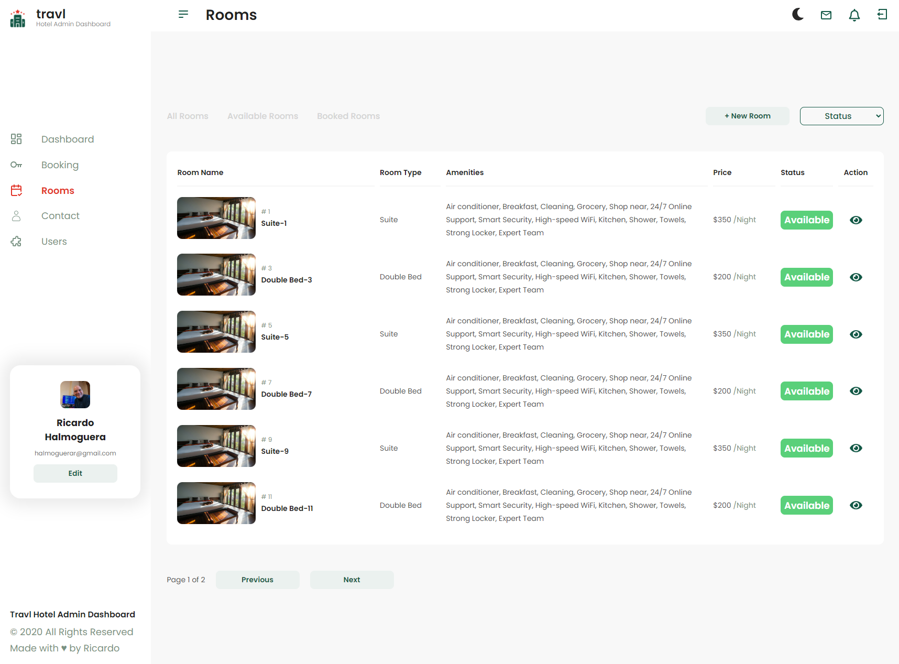
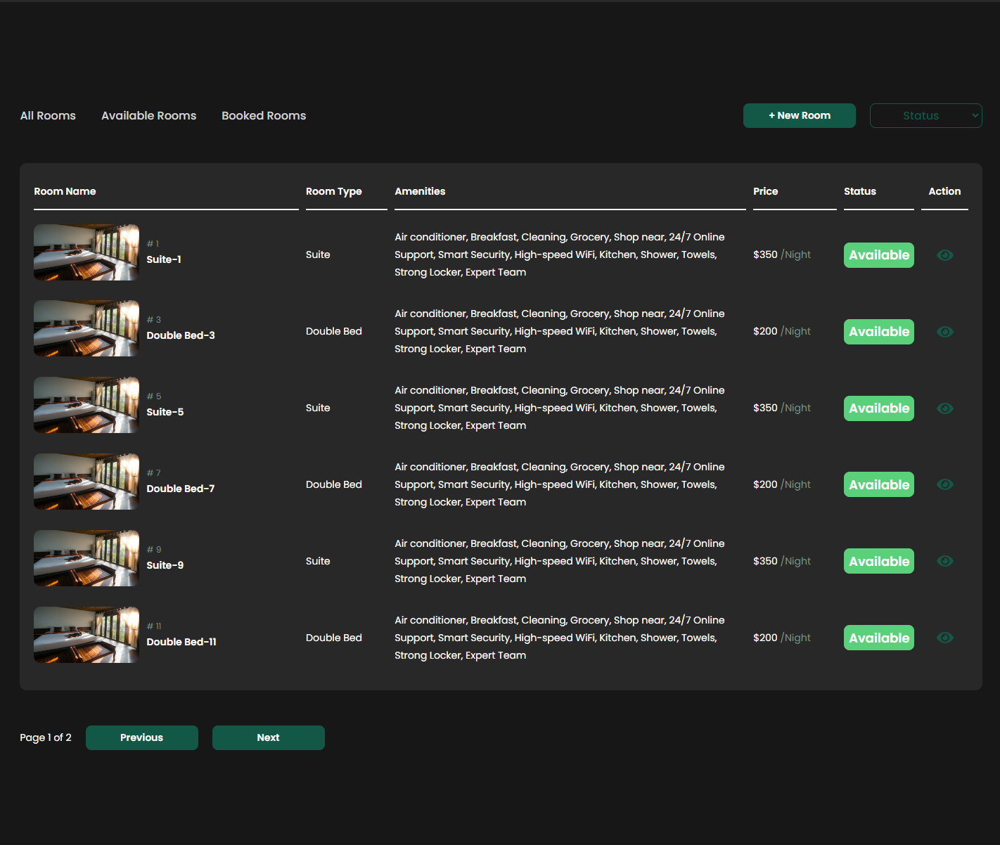

<h1 align="center">Hotel Miranda DashBoard V 1.0</h1>

<div align="center">
   Sprint 2 Oxygen Training
</div>

<div align="center">
  <h3>
    <a href="[rickhalmoguera.github.io/HotelMiranda/](http://dashboadbucket.s3-website.eu-west-3.amazonaws.com/)">
      Demo
    </a>
     <span> | </span>
    <a href="https://rickhalmoguera.github.io/PORTFOLIO/">
      Portfolio
    </a>
  </h3>
</div>

<!-- TABLE OF CONTENTS -->

## Table of Contents

- [Overview](#overview)
  - [Built With](#built-with)
- [Features](#features)
- [Contact](#contact)
- [Acknowledgements](#acknowledgements)

## Overview
Welcome to the Hotel Miranda's Dashboard! This app, developed using React, React Redux and Styled Components,  offers users a seamless experience to explore all the bookings, rooms info, and hotel's users.


#Light Mode Screenshot


# Dark Mode Screenshot


### Built With

- [React](https://es.react.dev/)
- [React-Router](https://reactrouter.com/en/main)
- [MUI componentes](https://mui.com/components/)
- [Css](https://developer.mozilla.org/es/docs/Web/CSS)
- [FlexBox](https://css-tricks.com/snippets/css/a-guide-to-flexbox/)
- [JavaScript](https://developer.mozilla.org/es/docs/Web/JavaScript)


## Features

This site was created as a submission to the Training in [Oxygen Academy](https://oxygenacademy.es/). Where we practice the following points:

- Practicing React folders structure.
- Usage of Routes from React Router.
- Sending and requesting data from JSON.
- Using LocalStorage inside the store with Redux.

We can observe these practices in the following features:

- A Nav bar that displays the routes in this App.
- Search Bar for Data ( Users).
- Create, Edit, Delete Data ( Users).

### Next Updates

- Calls From API.
- Create Bookings.
- Upload user photos
- Testing 

## How To Use

To clone and run this application, you'll need [Git](https://git-scm.com) and [Node.js](https://nodejs.org/en/download/) (which comes with [npm](http://npmjs.com)) installed on your computer. From your command line:

```bash
# Clone this repository
$ git clone https://github.com/RickHalmoguera/Oxygen-Shop
# install dependencies
$ npm install
# run project
$npm run dev
```


## Acknowledgements

- [Vite](https://vitejs.dev/)
- [Sass](https://sass-lang.com/guide/)
- [SwiperJs](https://swiperjs.com/)


## Contact

- Website [PORTFOLIO](https://rickhalmoguera.github.io/PORTFOLIO/)
- GitHub [@RickHalmoguera](https://github.com/RickHalmoguera)
